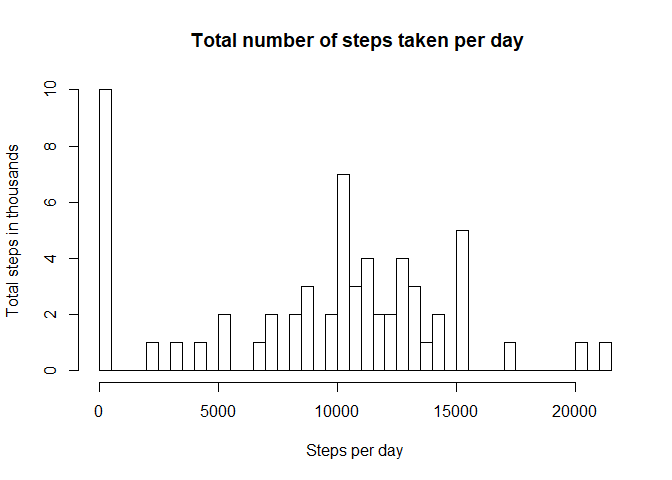
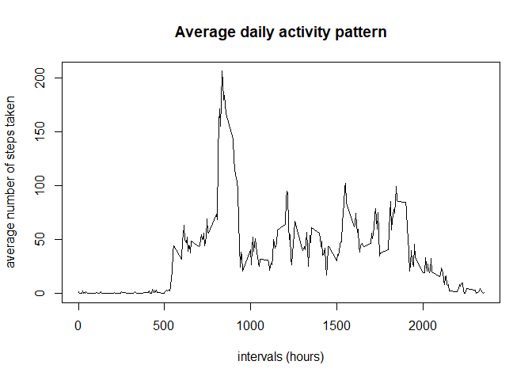
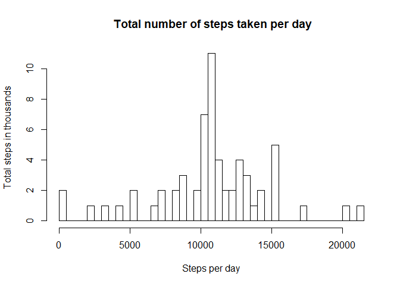

# Reproducible Research: Peer Assessment 1


## Loading and preprocessing the data

```r
unzip(zipfile="activity.zip")
df <- read.csv("activity.csv")
```

## What is mean total number of steps taken per day?
1. Calculate the total number of steps taken per day

```r
spd <- with(df, tapply(steps, date, sum, na.rm=TRUE))
```

2. Make a histogram of the total number of steps taken each day

```r
hist(spd, breaks = 61, main=" Total number of steps taken per day", xlab="Steps per day", ylab="Total steps in thousands")
```

<!-- -->

3. Calculate and report the mean and median of the total number of steps taken per day

```r
sprintf("%s is %3.2f", "Mean", mean(spd))
```

```
## [1] "Mean is 9354.23"
```

```r
sprintf("%s is %3.2f", "Median", median(spd))
```

```
## [1] "Median is 10395.00"
```

## What is the average daily activity pattern?
1. Make a time series plot (i.e.type = "l") of the 5-minute interval (x-axis) and the average number of steps taken, averaged across all days (y-axis)

```r
dap <- aggregate(x = list(steps = df$steps), by = list(interval = df$interval), FUN = mean, na.rm = TRUE)
plot(dap$interval, dap$steps, type="l", xlab="intervals (hours)", ylab="average number of steps taken", main="Average daily activity pattern")
```

<!-- -->

2. Which 5-minute interval, on average across all the days in the dataset, contains the maximum number of steps?

```r
dap[which.max(dap$steps),]
```

```
##     interval    steps
## 104      835 206.1698
```

## Imputing missing values
1. Calculate and report the total number of missing values in the dataset (i.e. the total number of rows with NAs)

```r
sum(is.na(df))
```

```
## [1] 2304
```

2. Devise a strategy for filling in all of the missing values in the dataset. The strategy does not need to be sophisticated. For example, you could use the mean/median for that day, or the mean for that 5-minute interval, etc. Funtion below will fill the missing values with mean for the interval.

```r
fill.steps <- function(steps, interval) {
    if (!is.na(steps)) 
        fill <- c(steps) else fill <- (dap[dap$interval == interval, "steps"])
    return(fill)
}
```

3. Create a new dataset that is equal to the original dataset but with the missing data filled in.

```r
fill.df <- df
fill.df$steps <- mapply(fill.steps, fill.df$steps, fill.df$interval)
```

4. Make a histogram of the total number of steps taken each day and Calculate and report the mean and median total number of steps taken per day. Do these values differ from the estimates from the first part of the assignment? What is the impact of imputing missing data on the estimates of the total daily number of steps?

```r
spd.new <- with(fill.df, tapply(steps, date, sum))
hist(spd.new, breaks = 61, main=" Total number of steps taken per day", xlab="Steps per day", ylab="Total steps in thousands")
```

<!-- -->


```r
sprintf("%s is %3.2f", "Mean", mean(spd))
```

```
## [1] "Mean is 9354.23"
```

```r
sprintf("%s is %3.2f", "New Mean", mean(spd.new))
```

```
## [1] "New Mean is 10766.19"
```

```r
sprintf("%s is %3.2f", "Median", median(spd))
```

```
## [1] "Median is 10395.00"
```

```r
sprintf("%s is %3.2f", "New Median", median(spd.new))
```

```
## [1] "New Median is 10766.19"
```
New mean and median are showing higher values from the first mean and median.

## Are there differences in activity patterns between weekdays and weekends?
1. Create a new factor variable in the dataset with two levels - "weekday" and "weekend" indicating whether a given date is a weekday or weekend day.

```r
dayType <- function(date) {
    day <- weekdays(date)
    if (day %in% c("Saturday", "Sunday")) return("weekend") else return("weekday")
}

fill.df$date <- as.Date(fill.df$date)
fill.df$day <- sapply(fill.df$date, FUN = dayType)
```

2. Make a panel plot containing a time series plot (i.e. type = "l") of the 5-minute interval (x-axis) and the average number of steps taken, averaged across all weekday days or weekend days (y-axis). See the README file in the GitHub repository to see an example of what this plot should look like using simulated data.


```r
library(ggplot2)
mean.step <- aggregate(steps ~ interval + day, data = fill.df, mean)
ggplot(mean.step, aes(interval, steps)) + geom_line() + facet_grid(day ~ .) + 
    xlab("5-minute interval") + ylab("Number of steps")
```

<!-- -->
